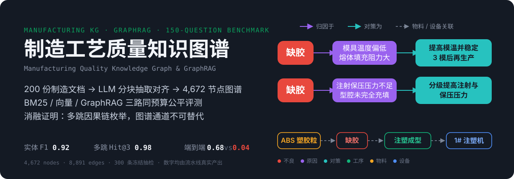
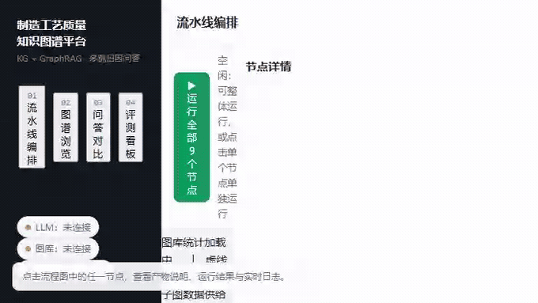
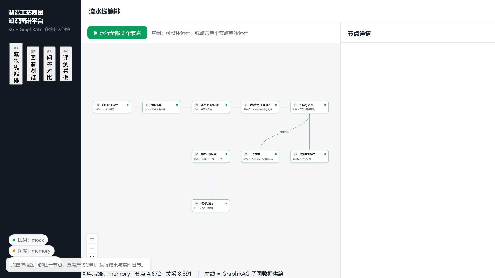
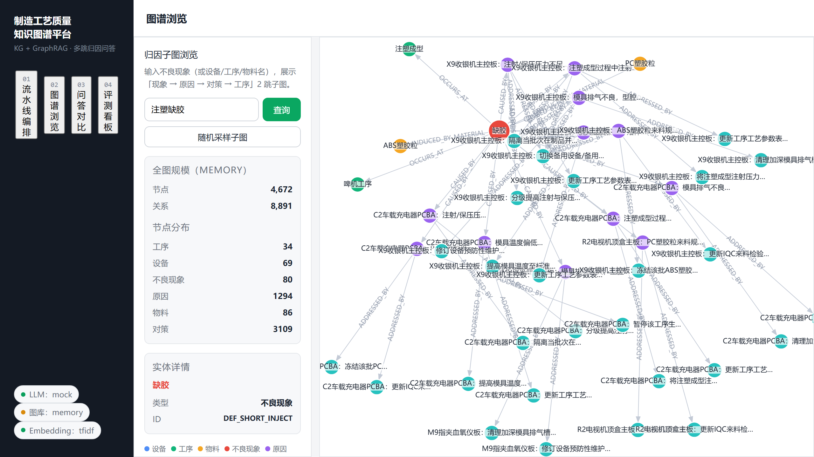
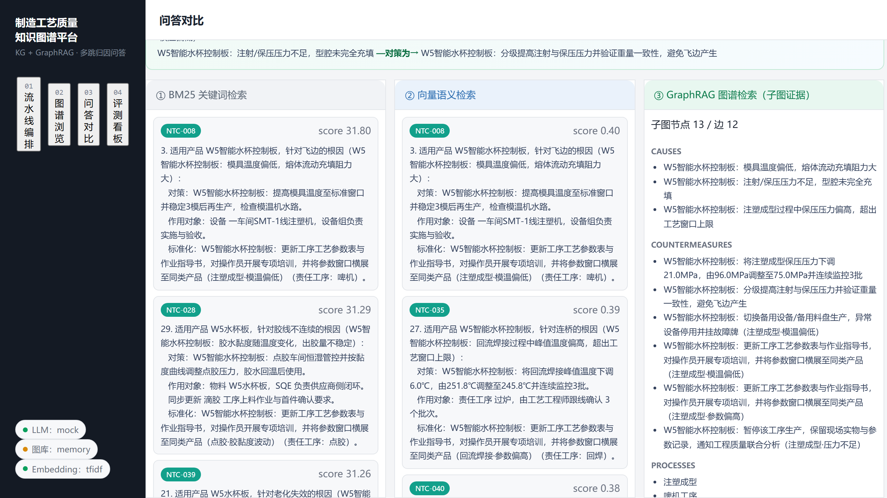
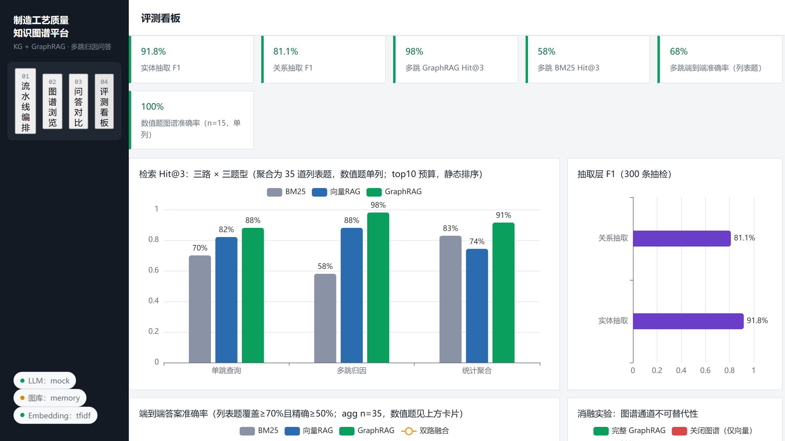
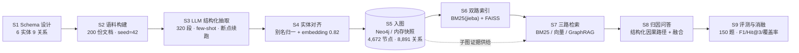

# 制造工艺质量知识图谱 · GraphRAG 归因问答平台

<p align="center">
  
</p>

<p>
  
  
  
  
  
  
  
  
</p>

<p align="center">
  <b><a href="#-产品演示">演示</a></b> ·
  <b><a href="#-核心结果公平口径-v2">结果</a></b> ·
  <b><a href="#-系统架构">架构</a></b> ·
  <b><a href="#-快速启动零-key--mock-全链路">快速启动</a></b> ·
  <b><a href="#-9-个流水线节点">九节点</a></b> ·
  <b><a href="#-评测结果完整指标">完整指标</a></b> ·
  <b><a href="#-常见问题">FAQ</a></b>
</p>

围绕「不良异常归因」业务，从 0 构建 **6 实体 / 9 关系** 领域 Schema，生成约 200 份制造文档并完成「LLM 结构化抽取 → 别名 + embedding 实体对齐 → Neo4j 入图 → BM25 / 向量 / GraphRAG 三路检索 → 多跳归因问答 → 150 题分层评测」的完整闭环，并提供 Dify 风格可视化编排、G6 图谱浏览、三路问答对比与 ECharts 评测看板。

- **零 API Key 可跑全链路**：mock 规则抽取 + TF-IDF 向量兜底，内存图库（可持久化快照）
- **配 Key 一键切真实能力**：已实测智谱 **GLM-4.5-AIR**（关闭思考模式）抽取/问答 + 智谱 **embedding-3**，OpenAI 兼容协议
- **长文档分块抽取**：工艺通知单按改善条目、异常单按不良块自动切分打包（320 段），根因/对策零遗漏，段级断点续跑
- **Neo4j 即插即用**：Docker 启动后无需改代码，重跑入图节点自动切换
- **公平评测口径**：三路同预算 / 同过滤 / 静态排序，题面注入别名与错别字噪声，并主动审计修正了四个"开卷"偏差

---

## 🎬 产品演示

**22 秒真实操作录屏**（九节点产物抽屉 → 归因子图查询 → 三路问答并排 → 评测看板）：

<p align="center">
  
</p>

**四个界面高清大图**（GIF 的静态版与细节补充）：

<table>
  <tr>
    <td width="50%"></td>
    <td width="50%"></td>
  </tr>
  <tr>
    <td align="center"><b>① 九节点流水线编排</b>（SSE 实时状态 / 日志 / 产物抽屉）</td>
    <td align="center"><b>② 归因子图浏览</b>（G6 力导向，6 类实体分色）</td>
  </tr>
  <tr>
    <td width="50%"></td>
    <td width="50%"></td>
  </tr>
  <tr>
    <td align="center"><b>③ 三路问答对比</b>（BM25 / 向量 / GraphRAG 同题并排）</td>
    <td align="center"><b>④ 评测看板</b>（F1 / Hit@3 / 端到端 / 消融）</td>
  </tr>
</table>

---

## 🏗 系统架构



---

## 📊 核心结果（公平口径 v2）

| 维度 | 关键数字 |
|---|---|
| LLM 抽取质量（300 条抽检） | 实体 **F1 0.92** · 关系 **F1 0.81** |
| 多跳检索 Hit@3 | BM25 0.58 / 向量 0.88 / **GraphRAG 0.98** |
| 多答案覆盖率 coverage@10 | BM25 0.47 / 向量 0.62 / **GraphRAG 0.81** |
| 多跳端到端准确率 | BM25 0.04 / 向量 0.04 / **GraphRAG 0.68** |
| 数值结构计数题 | 文本路 0.00–0.40 / **GraphRAG 1.00** |
| 消融：关闭图谱 | 多跳端到端 0.68 → **0.04** |

> 结论克制但清晰：检索层三路差距在公平口径下明显收窄，图谱不可替代的价值集中在**跨文档因果链的完整枚举**（coverage 0.81 vs 0.62）与**结构计数**（数值题 1.00 vs 0–0.40），而非"碰到一个答案"。
> 全部数字由流水线真实产出，见 `backend/data/eval/metrics_summary.json`，逐题证据见 `per_question.csv`。

> **深度文档**：[docs/设计说明.md](./docs/设计说明.md) —— 业务问题与领域 Schema、九节点流水线设计、实体对齐四通道、GraphRAG 定向多跳检索、150 题评测体系与公平口径、关键设计取舍。

---

## ⚡ 快速启动（零 Key · mock 全链路）

### 1) 后端

```powershell
cd backend
python -m venv .venv
.\.venv\Scripts\Activate.ps1
pip install -r requirements.txt
copy .env.example .env          # 默认 LLM_PROVIDER=mock、EMBEDDING_PROVIDER=tfidf
python run.py node all          # 依次跑 9 个节点（约 1-2 分钟，确定性 seed=42）
python run.py serve             # http://127.0.0.1:8010
```

### 2) 前端

```powershell
cd frontend
npm install
npm run dev                     # http://localhost:5173 （已代理 /api → 8010）
```

打开 http://localhost:5173 ：流水线编排（点节点看产物抽屉）、图谱浏览（输入「注塑缺胶」「虚焊」）、三路问答对比、评测看板。

### 重置后复跑

```powershell
python run.py reset            # 清除运行时产物（保留代码与本体模板）
python run.py node all
```

> 仓库已含内存快照、隐藏金标与评测产物，可直接 `serve` 浏览；要从零复现全链路再跑 `node all`。

---

## 🔧 接入真实 LLM / Embedding（可选）

编辑项目根目录 `.env`（代码读根目录；`backend/.env` 同步一份即可）。**已实测配置（智谱免费额度）**：

```env
LLM_PROVIDER=deepseek                              # 仅表示走 OpenAI 兼容协议
LLM_BASE_URL=https://open.bigmodel.cn/api/paas/v4
LLM_API_KEY=你的智谱APIKey
LLM_MODEL=glm-4.5-air                              # 实测最快最稳；glm-4.7 可用但慢，flash 系 429 频繁
LLM_DISABLE_THINKING=true                          # 必须：不关思考 content 直接返回空
LLM_EXTRACT_MAX_TOKENS=16000
EXTRACT_CONCURRENCY=3                              # 免费额度建议 3-4，过高触发限流（内置退避重试）

EMBEDDING_PROVIDER=zhipu
EMBEDDING_BASE_URL=https://open.bigmodel.cn/api/paas/v4/
EMBEDDING_API_KEY=你的智谱APIKey
EMBEDDING_MODEL=embedding-3
ALIGN_SIM_THRESHOLD=0.82
```

- **思考模式必须关**：GLM-4.5/4.7 推理模型默认先思考，抽取任务里思考 token 会占满输出窗口导致 `content=""`；代码通过 `extra_body.thinking.type=disabled` 关闭
- **长文档自动分块**：200 份文档切成 320 个段（SOP 整篇 / EX 按不良块 / NTC 按改善条目打包 ≤2600 字），体裁感知 prompt + 双 few-shot；段级 checkpoint 落盘，中断后重跑节点自动续抽；429/5xx/超时指数退避重试
- 实测耗时：glm-4.5-air 免费额度下 320 段约 1-2 小时（服务高峰单段 35-110s），费用 0
- embedding 用于：实体对齐相似度、文档块向量、问题实体链接；无 Key 时保持 `EMBEDDING_PROVIDER=tfidf` 离线兜底
- DeepSeek 同样可用：`LLM_BASE_URL=https://api.deepseek.com`、`LLM_MODEL=deepseek-chat`
- 切换模型/prompt 后从节点 3 重跑：`python run.py node all --start-from extract`（模式键含模型与 prompt 版本，自动失效旧产物）

---

## 🗄 接入 Neo4j（可选）

> Neo4j 为**可选后端**：已在 Docker Desktop + neo4j:5.24-community 容器 `kg-neo4j` 验证通过；未启动 Neo4j 时自动使用内存图库快照（4,672 节点 / 8,891 关系），接口同构、评测结果一致。

```powershell
docker compose up -d           # neo4j:5.24-community，bolt://localhost:7687，账号 neo4j / kg12345678
python run.py node ingest      # .env 中 GRAPHSTORE_AUTO_FALLBACK=true，连接成功即写 Neo4j
python run.py node retrieve    # 重建检索引擎
python run.py node qa
python run.py node evaluate    # Neo4j 后端重新评测
```

- 浏览器打开 http://localhost:7474 可直接执行 Cypher（平台后端也提供 `/api/graph/cypher`）
- Docker 未就绪时平台自动使用**内存图库快照**（`data/graph/memory_graph.json`），接口完全同构，不阻塞流程

---

## 📦 目录结构

```
kg-manufacturing/
├── docker-compose.yml          # Neo4j 5.24-community（含初始密码）
├── .env.example                # 环境变量模板（复制为 .env）
├── README.md
├── docs/                       # 设计说明 + assets（hero.svg / demo.gif / 界面截图）
├── backend/
│   ├── requirements.txt
│   ├── run.py                  # CLI：serve / node / all / reset
│   ├── data/
│   │   ├── ontology.yaml       # 本体源文件（节点1读取）
│   │   ├── schema/             # 节点1产物 ontology.yaml + schema_version.json
│   │   ├── gold/               # 隐藏金标（mention 偏移 + 三元组）/ 150 题 / 300 抽检集
│   │   ├── corpus/             # 200 份生成文档（运行时生成，已 gitignore）
│   │   ├── outputs/            # 抽取/对齐/入图/检索/问答产物（运行时生成，已 gitignore）
│   │   ├── index/              # BM25、faiss、实体链接索引（运行时生成，已 gitignore）
│   │   ├── eval/               # metrics_summary.json + per_question.csv
│   │   └── graph/              # 内存图库快照 memory_graph.json
│   └── app/
│       ├── main.py / config.py / db.py / llm.py / embedding.py
│       ├── kg_types.py         # 6 实体 9 关系闭域定义（唯一事实源）
│       ├── pipeline/
│       │   ├── meta.py         # 节点注册表（编排页节点定义）
│       │   ├── runner.py       # 线程池运行器（状态/日志写 SQLite，SSE 推送）
│       │   ├── seeds/knowledge_base.py  # 领域种子库（设备/工序/物料/不良/原因库）
│       │   └── nodes/s1..s9    # 9 个流水线节点
│       ├── retrieval/          # 切块、检索引擎（BM25/faiss/GraphRAG/融合）
│       ├── qa/questions.py     # 150 题测试集生成（50 单跳/50 多跳/35 聚合/15 数值）
│       ├── graphstore/         # GraphStore 抽象：memory 与 neo4j 同构实现
│       └── api/                # pipeline / graph / qa / eval / data 路由
└── frontend/
    └── src/
        ├── App.tsx / api.ts / index.css
        └── pages/              # PipelineFlow / GraphBrowser / QaCompare / EvalDashboard
```

---

## 🔗 9 个流水线节点

| #   | 节点        | 输入                   | 产物                                                                                                                                               |
| --- | --------- | -------------------- | ------------------------------------------------------------------------------------------------------------------------------------------------ |
| 1   | Schema 设计 | `data/ontology.yaml` | `schema/ontology.yaml` + `schema_version.json`（闭域校验，6 实体 9 关系）                                                                                          |
| 2   | 语料构建      | 种子库 + seed=42        | 200 份 txt（70 SOP / 90 异常单 / 40 通知单）+ 隐藏金标（mention 偏移 + 三元组）                                                                                      |
| 3   | LLM 结构化抽取 | corpus               | `entities.jsonl` / `relations.jsonl`（真实模式：长文档分 320 段 + 体裁感知 few-shot + JSON mode + 段级断点；mock 为分层词典+句式规则）；冻结 300 条抽检集 |
| 4   | 后处理与对齐    | 抽取产物                 | `entities_aligned.jsonl`：别名归一→一字符纠错→后缀归一→embedding 阈值（默认 0.82，同产品上下文保护）→新增实体                                                                     |
| 5   | Neo4j 入图  | 对齐产物                 | 幂等 MERGE；内存模式写快照；节点/关系统计校验                                                                                                                       |
| 6   | 双路索引      | corpus + 对齐实体        | chunks、rank_bm25（jieba）、faiss 向量、实体别名/语义链接索引                                                                                                     |
| 7   | 三路检索      | 150 题（57 题带别名/错别字噪声） | `retrieval_trace.jsonl`：BM25/向量 top10 chunk + GraphRAG 子图（三路同过滤/同预算/静态排序，公平口径 v2）                                          |
| 8   | 归因问答      | trace                | 四路结构化答案（bm25/vector/graph/hybrid）+ 证据 + 自然语言答复                                                                                                   |
| 9   | 评测与消融     | 全部产物                 | `metrics_summary.json` + `per_question.csv`                                                                                                      |

**语料中的关键机制设计（让指标差异可解释，而非人为编数）**：

- 异常单写「现象→原因」，根因对策拆成 **8D 三类**：临时遏制(D3) / 工程对策(D6) / 标准化(D7)；
- 原因与永久对策**跨文档分离**（约 30% 对策只在通知单）；通知单条目 70% 回指不良名称；
- 注入噪声：别名口语化（假焊/曼哈顿/墓碑…）、错别字（3%）、全半角/单位变体、多实体共现、长实体复述（12%）。

---

## 📈 评测结果（完整指标）

> **评测口径 v2**：为保证三路对比公平，评测设计主动审计并修正了四个系统性偏差——
> ① 三路候选统一按意图过滤（根因对策题三路都只计 CM_ 工程对策）；
> ② 数值题（15 题）从聚合组拆出单列；
> ③ 三路候选预算拉平（文本 top10 chunk，图谱同口径排序截断，统一 Hit@3/MRR 定义）；
> ④ 57/150 题面注入别名/错别字（30% 别名 + 8% 错别字），实体链接不再"开卷"。

### A. 抽取层（300 条抽检，GLM-4.5-AIR + embedding-3）

| 方案 | 实体 P | 实体 R | 实体 F1 | 关系 P | 关系 R | 关系 F1 |
|---|---|---|---|---|---|---|
| mock 规则（基线） | 0.90 | 0.86 | **0.90** | 0.86 | 0.84 | **0.85** |
| GLM-4.5-AIR | 0.92 | 0.91 | **0.92** | 0.84 | 0.79 | **0.81** |

图谱规模：**4,672 节点 / 8,891 关系**（新增实体率 2.6%，孤立率 1.2%）。

### B. 检索 Hit@3（新口径：top10 预算、确定性静态排序、噪声题面）

| 题型 | BM25 | 向量RAG | GraphRAG |
|---|---|---|---|
| 单跳（n=50） | 0.70 | 0.82 | **0.88** |
| 多跳（n=50） | 0.58 | 0.88 | **0.98** |
| 聚合列表题（n=35） | 0.83 | 0.74 | **0.91** |

多跳 MRR：BM25 0.49 / 向量 0.77 / **GraphRAG 0.87**。

**多答案覆盖率（比 Hit@3 更本质的指标，多跳题）**：coverage@3 三路 0.24/0.42/**0.76**；coverage@10 为 0.47/0.62/**0.81**；全候选覆盖率 0.50/0.62/**0.81**——图谱的真实优势在"找全"而非"碰到一个"。

### C. 端到端答案准确率（列表题：覆盖≥70% 且精确≥50%；数值题：±1 容差，单列）

| 题型 | BM25 | 向量RAG | GraphRAG | 双路融合 |
|---|---|---|---|---|
| 单跳（n=50） | 0.32 | 0.30 | **0.96** | 0.64 |
| 多跳（n=50） | 0.04 | 0.04 | **0.68** | 0.68 |
| 聚合列表题（n=35） | 0.11 | 0.14 | **0.69** | 0.60 |
| **数值题（n=15，单列）** | 0.40 | 0.00 | **1.00** | 1.00 |

注意多跳的"检索强、端到端弱"：向量路 Hit@3 已达 0.88，但端到端仅 0.04——top10 chunk 内对策覆盖率 0.62 < 0.70 判分线；图谱 coverage 0.81 达标。**这是公平口径下图谱仍不可替代的核心证据。**

### D. 图谱消融（新口径）

| 多跳归因 | Hit@3 | 端到端准确率 |
|---|---|---|
| 完整双路（图谱开） | **0.98** | 0.68 |
| 关闭图谱（仅向量） | 0.88 | **0.04** |

聚合列表题：图谱开 0.91 / 关 0.74（Hit@3），准确率 0.60 / 0.14。

### E. 实体链接鲁棒性（v2 新增观测）

题面噪声化后，150 题共 293 次锚点链接：别名表 283 次、**embedding 语义补链 10 次（v1 为 0，从未被测过）**；含错别字的 9 题全部链接成功，问题链接成功率 150/150。

> mock 轮数字为历史基线（旧口径 TF-IDF），未在新口径下复跑，不作为对比依据。

---

## 📡 API 速查

后端统一前缀 `/api`，主要端点：

| 方法 | 路径 | 用途 |
|---|---|---|
| GET | `/api/health` | 健康检查（LLM / Embedding / 图库后端状态） |
| GET | `/api/nodes` | 九节点状态与最近一次运行统计 |
| POST | `/api/nodes/{id}/run` | 触发单个节点 |
| POST | `/api/pipeline/run-all` | 全量运行（可带 `start_from`） |
| GET | `/api/events` | SSE：实时日志流 |
| GET | `/api/graph/stats` | 节点 / 关系统计 |
| GET | `/api/graph/causal?name=虚焊` | 归因子图查询 |
| POST | `/api/graph/cypher` | 自定义 Cypher（仅 Neo4j 后端） |
| POST | `/api/qa/ask` | 三路召回 + 图谱路径问答 |
| GET | `/api/eval/summary` | 评测指标 JSON |
| GET | `/api/eval/per-question` | 逐题判分明细 |

> PowerShell 下用 `Invoke-RestMethod` POST 中文时，body 需显式 UTF-8 编码（`[System.Text.Encoding]::UTF8.GetBytes(...)` 并指定 `ContentType 'application/json; charset=utf-8'`），否则会按系统编码解出乱码。

---

## 💡 常见问题

1. **端口 8010 被占用**：`Get-NetTCPConnection -LocalPort 8010 -State Listen` 找到 PID 后 `Stop-Process -Id <PID> -Force`。
2. **中文路径下 faiss 报错**：已规避（索引序列化为字节用 Python 写盘，不走 C++ fopen）。
3. **图库显示 memory**：Docker 未启动或 Neo4j 未就绪；启动后重跑 ingest 即切换，数据不丢。
4. **LLM 调用中断/429**：真实模式按**段级** checkpoint 续跑（`outputs/.extract_chunks.jsonl`），重跑节点自动跳过已完成段；成功调用另有 prompt 级 SQLite 缓存；429/5xx/超时已内置指数退避。若返回空 content，先确认 `LLM_DISABLE_THINKING=true`。
5. **想改图谱规模/噪声**：调 `s2_corpus.py` 中文档数配比、`s3_extract.py` 中 `PACK_MAX_CHARS`（分块粒度）/覆盖率常量、`.env` 中 `ALIGN_SIM_THRESHOLD`，改 prompt 记得升 `PROMPT_VERSION`，重跑对应节点即可在看板看到指标变化。
